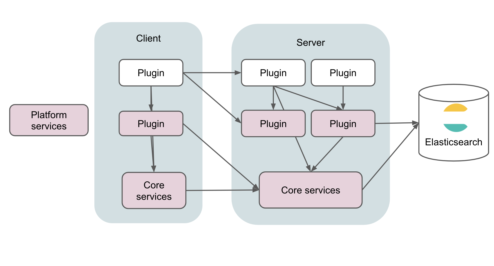

Kibana is an extensible plugin system. A set of core client side and server side functionality is provided to every plugin to
make developing custom applications, or extending existing applications, easy.

<DocCallOut title="Note">
Any plugin that exports functionality from `public/index.ts`, `server/index.ts`, or `common/index.ts`, or, returns functionality
from the `setup` or `start` lifecycle functions is exposing a public API and considered a _platform service_.
</DocCallOut>

## Core services

<DocLink id="kibCoreServices" text="Core services"/> includes functionality like the ability to register an application, routes,
create or query for saved objects, and much more. This functionality is available to every plugin via the first parameter passed into every
plugin's `setup` and `start` lifecycle method. 

- <DocLink id="kibCorePluginArch" text="How to create a plugin."/>

## Platform plugin services

Additional functionality provided by other registered plugins is available via the second parameter passed into every
plugin's `setup` and `start` lifecycle method. In order to access this functionality, the dependency must be declared
inside your plugins manifest file.

Services that are fundamental to plugin development tend to go into core, while optional services exist as functionality
registered by plugins, but this line can be blurry (for example, an argument could be made that the <DocLink id="kibDataPlugin" text="Data plugin"/>
 is fundamental and should reside inside core). 

